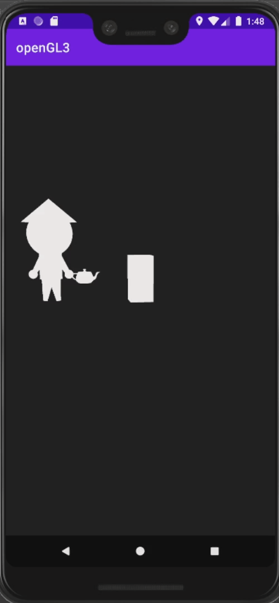

# Homework 1
The homework 1 tests your understand about spaces, transforms and vertex processing.  
Let's develop an android application with OpenGL ES SDK!

* [Procedure](#procedure)
* [Result](#result)
* [Deadline](#deadline)
* [Q & A](#qa)

## Procedure
1. Download the files in this repository and unzip the GG2021_HW1.zip. 
   - (Password is required. Please check the e-campus information.)
2. Follow the instructions provided by GameGraphics_Homework1_Guide.pdf
3. Invest your time to achieve the goal!

## Result

## Deadline
* If spring class: 05.04. 23:59

## Q & A
* teclados078@khu.ac.kr (정승재)
* Thank you for your star.
